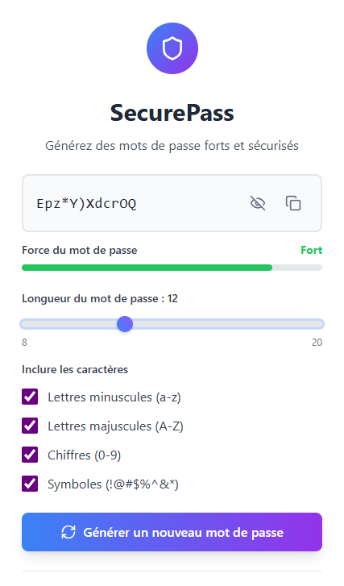

# 🔐 SecurePass – Gérez vos mots de passe en toute sécurité

**SecurePass** est une application de bureau moderne (Windows, basée sur Electron) utilisant les technologies web, conçue pour vous aider à stocker, générer et gérer vos mots de passe de façon sécurisée.
Grâce à une interface simple et efficace, gardez le contrôle sur vos identifiants et protégez vos données sensibles.

---

## 🎬 Démo vidéo

👉 [Voir la vidéo de présentation](assets/securepass.mp4)

---

## 🖼️ Aperçu




*Des captures d'écran seront ajoutées prochainement pour illustrer l’interface.*

---

## ✨ Fonctionnalités principales

- 🔒 **Stockage sécurisé** : Sauvegardez vos mots de passe localement
- 🛡️ **Générateur de mots de passe** : Créez des mots de passe robustes en un clic (JS & WebAssembly)
- 🖥️ **Interface moderne** : Application web responsive et intuitive
- ⚡ **Performance** : Application rapide grâce à Vite et React
- 🧩 **Extensible** : Code source modulaire pour faciliter l’ajout de fonctionnalités
- 🖱️ **Application Desktop** : Fonctionne aussi comme application de bureau grâce à Electron

---

## 🛠️ Technologies utilisées

### 🔧 Frontend
- 
- 
- 
- 

### 🎨 UI & Design
- 
- 
- 

### 🖥️ Application Desktop
- 
- 

### 🧪 Qualité & Outils Dev
- 
- 

### 🔐 Sécurité & Chiffrement
- Utilisation de `crypto.getRandomValues` côté JS pour la génération sécurisée

### ⚙️ Autres
- 
- 

---

## 🚀 Installation locale

```bash
# Cloner le dépôt
git clone https://github.com/votre-utilisateur/securepass.git

# Aller dans le dossier du projet
cd securepass

# Installer les dépendances
npm install

# Lancer le serveur de développement (web)
npm run dev

# Lancer l'application desktop (Electron)
npm run electron
```

---

## 🌐 Variables d'Environnement

*Aucune variable d’environnement n’est requise pour l’instant.*  
(Si besoin, ajoutez ici les instructions pour les clés ou configurations spécifiques.)

---

## 🤝 Contribution

Les contributions sont les bienvenues ! N'hésitez pas à ouvrir une issue ou à proposer une pull request.

---

## 📄 Licence

Ce projet est sous licence MIT - voir le fichier [LICENSE](LICENSE) pour plus de détails.
